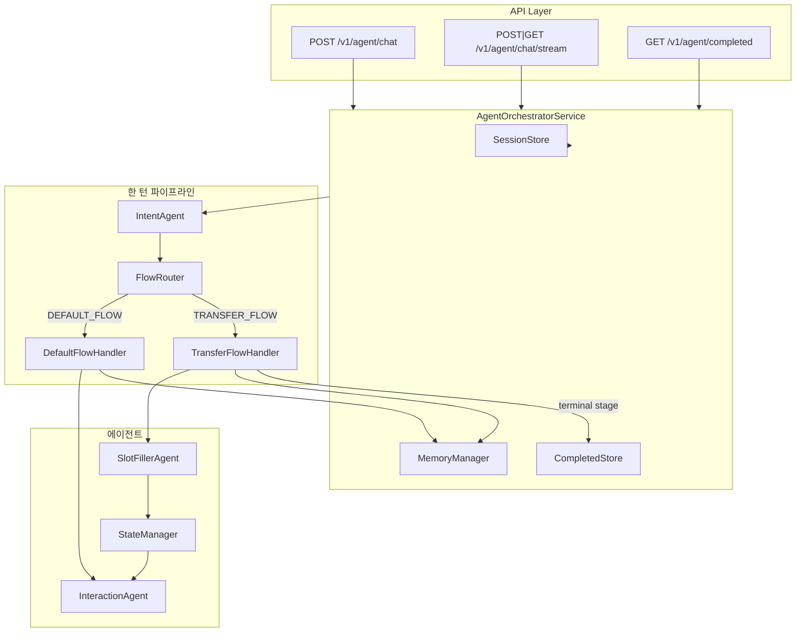

# 이체(Transfer) 에이전트 파이프라인

이체 요청을 처리하는 **멀티 에이전트 대화형 파이프라인**입니다.  
Intent 분류 후 FlowRouter로 플로우를 나누고, **일반 대화(DEFAULT_FLOW)** 또는 **이체 플로우(TRANSFER_FLOW)**에서 Slot Filling → State 적용 → Interaction 순으로 진행됩니다. 세션·메모리·완료 이력을 관리합니다.

---

## 파이프라인 다이어그램

### 전체 흐름 (ASCII)

```
┌─────────────────────────────────────────────────────────────────────────────────────────┐
│                              API Layer (FastAPI)                                          │
│   POST /v1/agent/chat   │   POST·GET /v1/agent/chat/stream   │   GET /v1/agent/completed  │
└─────────────────────────────────────────────────────────────────────────────────────────┘
                                          │
                                          ▼
┌─────────────────────────────────────────────────────────────────────────────────────────┐
│                         AgentOrchestratorService                                          │
│  SessionStore (세션별 state + memory)  ·  CompletedStore  ·  MemoryManager + Summarizer   │
└─────────────────────────────────────────────────────────────────────────────────────────┘
                                          │
                                          ▼
                              ┌───────────────────────┐
                              │   Intent (Executor)   │  ← AgentExecutor + ExecutionAgent
                              │   TRANSFER / 기타     │     (retry, schema 검증)
                              └───────────┬───────────┘
                                          │
                                          ▼
                              ┌───────────────────────┐
                              │     FlowRouter        │
                              │  intent + state 기준   │
                              │  플로우 선택          │
                              └───────────┬───────────┘
                                          │
                    ┌─────────────────────┴─────────────────────┐
                    ▼                                           ▼
        ┌───────────────────────┐                   ┌───────────────────────┐
        │   DEFAULT_FLOW        │                   │   TRANSFER_FLOW       │
        │   (DefaultFlowHandler)│                   │ (TransferFlowHandler) │
        └───────────┬───────────┘                   └───────────┬───────────┘
                    │                                           │
                    │  Interaction만 수행                       │  Slot 추출 → State 적용
                    │  메모리 갱신 → DONE                        │  → Interaction → 메모리
                    │                                           │  → terminal이면 Completed 저장
                    │                                           │  → DONE
                    └─────────────────────┬─────────────────────┘
                                          │
                                          ▼
                              ┌───────────────────────┐
                              │  SessionStore.save    │
                              │  (state + memory)     │
                              └───────────────────────┘
```

### TRANSFER_FLOW 상세

```
  사용자 메시지
        │
        ▼
┌───────────────┐     operations      ┌─────────────────┐
│ Slot Executor │ ──────────────────► │  StateManager   │
│ (SlotFiller)  │                     │  apply(delta)   │
└───────────────┘                     │  validate       │
                                      │  transition     │
                                      └────────┬────────┘
                                               │
                                               ▼
                                      ┌─────────────────┐
                                      │ Interaction     │
                                      │ (state, history,│
                                      │  memory 요약)   │
                                      └────────┬────────┘
                                               │
                          stage ∈ {EXECUTED, FAILED, CANCELLED}
                                               │
                                               ▼
                                      ┌─────────────────┐
                                      │ CompletedStore  │
                                      │ .add(session,   │
                                      │  state, memory) │
                                      └─────────────────┘
```

### Mermaid 플로우차트



### 코어 파이프라인 단계 (한 턴)

| 순서 | 단계 | 담당 | 설명 |
|------|------|------|------|
| 1 | Intent | IntentAgent (Executor) | 사용자 메시지 → `TRANSFER` 또는 기타 |
| 2 | 라우팅 | FlowRouter | `state.stage != INIT`이면 TRANSFER_FLOW, 아니면 intent가 TRANSFER일 때만 TRANSFER_FLOW |
| 3 | DEFAULT_FLOW | DefaultFlowHandler | Interaction만 수행 → 메모리 갱신 → DONE |
| 4 | TRANSFER_FLOW · Slot | SlotFillerAgent (Executor) | 메시지에서 슬롯 추출 → `operations` (set/clear/confirm/cancel_flow 등) |
| 5 | State 적용 | StateManager | `apply(delta)` → 슬롯 반영, 필수 검증, stage 전이 (FILLING→READY 등) |
| 6 | Interaction | InteractionAgent | state + history + memory 요약으로 응답 메시지/UI 생성 |
| 7 | 완료 처리 | TransferFlowHandler | stage가 EXECUTED/FAILED/CANCELLED이면 CompletedStore에 저장 |
| 8 | 공통 | Orchestrator | 메모리 갱신, SessionStore 저장 후 DONE |

---

## 프로젝트 구조

```
mockup/
├── app/
│   ├── main.py                      # FastAPI 앱, 라우터 등록
│   ├── core/
│   │   ├── config.py                # APP_NAME, MAX_FILL_TURNS, MEMORY_MAX_RAW_TURNS 등
│   │   └── logging.py               # 로거 설정
│   ├── api/v1/
│   │   └── routes_agent.py          # POST /chat, POST|GET /chat/stream, GET /completed
│   ├── schemas/
│   │   └── agent.py                 # AgentChatRequest, AgentChatResponse
│   └── services/
│       ├── events.py                # EventType (FLOW, LLM_DONE, DONE 등)
│       ├── orchestrator/
│       │   ├── agent_orchestrator.py  # 파이프라인 진입점 (Intent → FlowRouter → Handler)
│       │   ├── flow_router.py         # intent + state 기반 DEFAULT_FLOW / TRANSFER_FLOW
│       │   └── flow_handler.py       # DefaultFlowHandler, TransferFlowHandler
│       ├── agents/
│       │   ├── base_agent.py        # LLM 호출, make_hook()
│       │   ├── registry.py          # intent / slot / interaction 카드 기반 등록
│       │   ├── schemas.py           # IntentResult, SlotResult, InteractionResult
│       │   ├── intent/
│       │   ├── slot_filler/
│       │   └── interaction/
│       ├── state/
│       │   ├── models.py            # TransferState, Slots, Stage, SLOT_SCHEMA
│       │   ├── state_manager.py     # apply(delta), validate, transition
│       │   └── stores.py            # SessionStore, CompletedStore
│       ├── execution/
│       │   └── execution_agent.py   # retry/검증 래퍼, AgentExecutor (FLOW 훅)
│       ├── memory/
│       │   ├── memory_manager.py    # raw_history 누적, 압축(요약)
│       │   ├── summarizer_agent.py  # 대화 요약
│       │   └── prompts.py
│       └── llm/
│           └── openai_client.py     # OpenAI API 래퍼
├── requirements.txt
└── README.md
```

---

## 주요 컴포넌트

| 컴포넌트 | 역할 |
|----------|------|
| **AgentOrchestratorService** | 한 턴: Session 조회 → Intent(Executor) → FlowRouter → DefaultFlowHandler 또는 TransferFlowHandler 실행. stream/non-stream 모두 `_core_stream` 제너레이터 기반. |
| **FlowRouter** | intent와 state로 플로우 결정. 이미 이체 진행 중(state.stage != INIT)이면 TRANSFER_FLOW, 아니면 intent가 TRANSFER일 때만 TRANSFER_FLOW. |
| **DefaultFlowHandler** | TRANSFER가 아닌 경우. Interaction만 호출 후 메모리 갱신, DONE 반환. |
| **TransferFlowHandler** | Slot 호출 → StateManager.apply → Interaction → 메모리 갱신, terminal stage면 CompletedStore.add → DONE. |
| **IntentAgent / SlotFillerAgent / InteractionAgent** | AgentExecutor로 래핑되어 실행(retry, schema 검증). Intent는 TRANSFER/기타, Slot은 operations, Interaction은 메시지·ui_hint 등. |
| **StateManager** | `apply(delta)`로 operations 적용(set/clear/confirm/cancel_flow/continue_flow), 필수 슬롯 검증, stage 전이. |
| **ExecutionAgent** | LLM 에이전트 호출의 retry·validation 래퍼. AgentExecutor가 intent/slot/interaction 호출 시 사용. |
| **SessionStore** | 세션별 `TransferState` + `memory`(raw_history, summary_text, summary_struct). |
| **CompletedStore** | terminal stage(EXECUTED, FAILED, CANCELLED)인 세션 스냅샷을 세션별로 보관. |
| **MemoryManager** | 턴마다 raw_history 추가, 설정 턴 수 초과 시 Summarizer로 압축 후 raw_history 비움. |

---

## 상태(Stage) 흐름

```
INIT → FILLING → READY → CONFIRMED
                ↑
                └── AWAITING_CONTINUE_DECISION (필요 시)
                └── CANCELLED (cancel_flow op)

터미널: EXECUTED, FAILED, CANCELLED  → CompletedStore 저장
```

- **필수 슬롯**: `target`, `amount` (models.REQUIRED_SLOTS).
- **READY**: 필수 슬롯이 모두 채워진 상태. 사용자 확인 후 `confirm` op로 CONFIRMED로 전이.

---

## API 요약

| 메서드 | 경로 | 설명 |
|--------|------|------|
| POST | `/v1/agent/chat` | 비스트리밍 채팅. `session_id`, `message` → `{ interaction, hooks }` |
| POST / GET | `/v1/agent/chat/stream` | 스트리밍 채팅 (SSE). `session_id`, `message` (POST body 또는 GET 쿼리). 이벤트: FLOW, DONE 등 |
| GET | `/v1/agent/completed` | 해당 세션의 완료 이체 이력 목록 (`session_id` 쿼리) |

---

## 실행 방법

```bash
# 의존성 설치
pip install -r requirements.txt

# 환경 변수 (OPENAI_API_KEY 등) 설정 후 서버 실행
uvicorn app.main:app --reload
```

---

## 정리

- **파이프라인**: API → Orchestrator → Intent → FlowRouter → (DEFAULT_FLOW: Interaction만 | TRANSFER_FLOW: Slot → StateManager → Interaction) → 메모리·세션 저장, terminal 시 Completed 저장 → DONE.
- **스토리지**: SessionStore(진행 중 세션), CompletedStore(완료 이력), MemoryManager(대화 압축).
- **에이전트**: `agents/registry.py`와 각 에이전트의 `card.json`으로 LLM 설정이 로드되며, Intent / Slot / Interaction은 BaseAgent + AgentExecutor(ExecutionAgent 래퍼)를 사용합니다.
